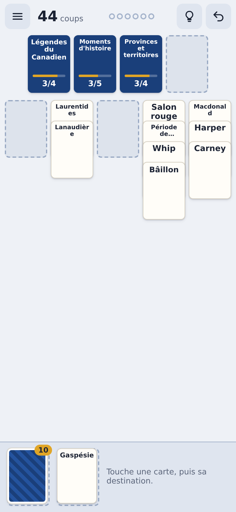

# Solitaire Association

Un solitaire d'associations de mots **100 % québécois**, conçu pour le cellulaire, **sans pub**.

Des cartes-mots (Tuque, Poutine, Tabarnouche, Rimouski…) et des cartes-catégories
(Vêtements en québécois, Bouffe québécoise, Sacres adoucis…) sont mélangées dans des
colonnes façon Klondike. Ouvre une catégorie, range-y ses mots, et vide la table avant
de manquer de coups.



## Jouer

- Ouvre `index.html` dans un navigateur, c'est tout : aucun serveur ni compilation requis.
- **Défi du jour** : la même donne pour tout le monde, chaque jour (partage ton résultat).
- **Partie libre** : Facile / Moyen / Difficile, et choix des thèmes.
- Règles complètes : [docs/REGLES.md](docs/REGLES.md).

## Thèmes inclus (v0.1)

Politique · Culture pop · Science · Technologie · Cinéma · Géographie ·
Jurons québécois · Villes du Québec · Musique franco — 52 catégories, 450 mots.

Pour ajouter des mots : [docs/BANQUES.md](docs/BANQUES.md).

## Structure

```
index.html            Page unique (accueil + jeu + fenêtres)
css/style.css         Styles, mobile d'abord, mode sombre automatique
js/moteur.js          Règles, génération des donnes, solveur (sans DOM, testable)
js/app.js             Interface : rendu, toucher-pour-poser, sauvegarde, stats
data/banques.js       Banques de mots par thème
tests/test-moteur.js  Tests du moteur (Node)
outils/valider-banques.js  Vérifie doublons, tailles, longueurs
docs/                 Règles, guide des banques, publication
```

## Développement

Il faut [Node.js](https://nodejs.org/) seulement pour les tests (pas pour jouer).

```bash
npm test            # tests du moteur + validation des banques
npm run serve       # petit serveur local (facultatif)
```

## Publier

GitHub Pages ou itch.io : voir [docs/PUBLIER.md](docs/PUBLIER.md).

## Principes

- Aucune pub, aucun traqueur, aucune dépendance externe.
- Tout fonctionne hors ligne une fois la page chargée.
- Progression et statistiques gardées dans le navigateur (localStorage).
